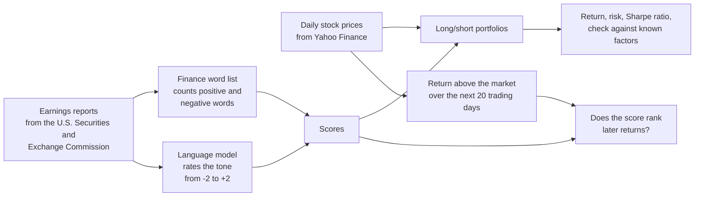

# Can a language model read earnings reports well enough to predict stock returns?

Every three months, each public company publishes an earnings report: a press
release with its results and what management expects next. This project asks a
language model (Claude, the same kind of artificial intelligence as ChatGPT) to
read 525 of these reports and rate how upbeat or gloomy management sounds. It
then checks whether those ratings predict how the stock does over the following
month, and whether the model does better than a classic method that simply
counts positive and negative words.

---

## In short

**An everyday comparison.** Imagine a shop owner who writes a letter to
investors every three months. Most readers look at the sales figures. This
project asks a different question: can a careful reader tell from the *tone*
of the letter, from how confident or worried the owner sounds, whether the shop
will do better or worse than its neighbours over the next month?

**What happened.** Stocks whose reports the language model rated most upbeat
did better than the market over the next 20 trading days (about one month),
and stocks it rated most gloomy did worse. The gap was small but steady. The
word-counting method found nothing useful.

**The big caveat.** The model learned from internet text up to June 2026, which
is *after* every report in this study (July 2023 to December 2025). It may have
read news about how these stocks moved, so part of its "skill" could be memory.
Treat the results as a best case, not proof. The section
[Biases and limitations](#biases-and-limitations) explains how to test this
properly for free.

## Key results in plain words

| Question | Answer |
|---|---|
| Does the model's tone rating line up with the next month's returns? | Yes, a little. Rank correlation of +0.08 (0 = no link). The finance word list scored −0.04, which is no better than chance. |
| Is that just luck? | Probably not, but it is close. In 8 of 10 earnings seasons the link was positive. The t-statistic was 1.98, right at the usual "about 2 or more" bar for "unlikely to be luck". |
| How big was the difference in returns? | The most upbeat fifth of reports beat the market by 0.41% over 20 days. The most gloomy fifth trailed it by 0.57%. |
| Could you have made money trading on it? | On paper, yes for one month: buying the upbeat fifth and selling short the gloomy fifth, holding each for 20 trading days, gave a Sharpe ratio of 1.41 after costs (above 1 is good). Waiting until after each earnings season to trade mostly lost the effect (Sharpe ratio 0.21). |
| Which part of the report mattered most? | What management said about **future guidance**, and how that changed since the previous quarter. Comments on **customer demand** showed nothing. |
| Does the model give the same answer twice? | Yes. Scoring the same reports a second time gave the identical guidance rating 80% of the time, and it was never more than one step apart. |

## What the numbers mean

| Term | Plain meaning |
|---|---|
| Earnings report | A company's press release with its quarterly results, filed with the U.S. Securities and Exchange Commission as a "Form 8-K". |
| Tone score | The model's rating from −2 (clearly negative, for example guidance cut) to +2 (clearly positive, for example guidance raised). |
| Return above the market | The stock's return minus the return of an S&P 500 index fund over the same days. It removes the effect of the whole market going up or down. |
| Information coefficient | How well a score *ranks* stocks by their later returns. A rank correlation from −1 to +1; 0 means no link. In investing, +0.05 to +0.10 is considered useful. |
| t-statistic | How confident we can be that a result is not luck. Roughly, 2 or more means "unlikely to be chance". |
| Hit rate | How often the most upbeat and most gloomy fifths moved the way their score predicted. 50% is a coin flip. |
| Long/short portfolio | Buy the stocks with the most upbeat reports and sell short (bet against) those with the most gloomy reports. It makes money if the first group beats the second, whatever the overall market does. |
| Sharpe ratio | Return earned per unit of risk taken. Above 1 is good; the stock market as a whole is usually around 0.4 to 0.6. |
| Maximum drawdown | The worst fall from a high point to a later low point. |
| Fama-French factors | Well-known drivers of stock returns (the overall market, company size, cheap versus expensive stocks, profitability, investment, and recent winners or "momentum"). Checking against them shows whether a strategy is just repeating a known pattern. |
| Alpha | The part of a strategy's return that those known factors cannot explain. |
| Training cutoff | The date up to which the language model learned from text. Anything before it, the model may already have read about. |

---

## Detailed results

The section below is written automatically by `earnsig report` from the files in
[`results/`](results/).

<!-- RESULTS:START -->

> [!CAUTION]
> **Every report in this sample is older than the language model's training cutoff (2026-06-30).** The model may have read news about how these stocks moved
> after each report, so a good result here can come from memory rather than reading skill.
> Treat it as a best case. A clean test needs a model trained before the reports were published
> (see *Biases and limitations* below).

_Sample: 525 earnings reports from 50 companies, 2023-07-07 to 2025-12-23. Scored by: Claude Code (haiku). Returns are measured above the S&P 500 index fund (SPY). Trading costs: 0.10% per trade plus 0.50% a year to borrow shares for selling short._


### All measures

| Measure | Language model tone | Finance word list |
|---|---:|---:|
| Reports with a score | 525 | 525 |
| Information coefficient: rank correlation of score with the 20-day return above the market | +0.082 | -0.038 |
| t-statistic of the information coefficient across seasons (about 2 or more = unlikely to be luck) | 1.98 | -0.74 |
| Earnings seasons where the correlation was positive | 80% of 10 | 50% of 10 |
| Hit rate: top and bottom fifth that moved the predicted way | 55.5% | 52.6% |
| Average 20-day return above the market, most upbeat fifth / most gloomy fifth | 0.41% / -0.57% | -0.27% / 0.12% |
| **Long/short portfolio, rebalanced each season, after costs:** yearly return | 2.7% | -3.3% |
| Yearly volatility (typical size of ups and downs) | 12.8% | 12.3% |
| Sharpe ratio (return per unit of risk), after costs (before costs) | 0.21 (0.32) | -0.27 (-0.19) |
| Maximum drawdown (worst fall from a peak) | -18.1% | -19.9% |
| Turnover per rebalance (replacing every holding = 400%) | 212% | 118% |
| Holding periods that made money | 60% | 60% |
| **Long/short portfolio, each report held 20 trading days, after costs:** Sharpe ratio | 1.41 | -0.94 |
| Maximum drawdown | -14.3% | -46.6% |
| **Fama-French five factors plus momentum:** alpha, yearly return not explained by the factors (t-statistic) | 1.5% (0.22) | -7.6% (-1.20) |
| Market beta (sensitivity to the overall stock market) | -0.09 | +0.22 |
| Size / value / profitability / investment betas | -0.18 / -0.25 / -0.19 / +0.02 | +0.08 / -0.23 / -0.06 / -0.01 |
| Momentum beta (tendency to hold recent winners) | +0.20 | +0.20 |
| R-squared (share of the ups and downs explained by the factors) | 0.23 | 0.28 |
| Information coefficient using only reports after the model's training cutoff (number of reports) | none: every report is older than the cutoff | none: every report is older than the cutoff |


### Which topic matters most?

Each report also got separate scores for what management said about future guidance, profit margins and customer demand.

| Score | Information coefficient | t-statistic | Hit rate | Sharpe ratio, seasonal portfolio | Sharpe ratio, 20-day portfolio |
|---|---:|---:|---:|---:|---:|
| Language model tone | +0.082 | 1.98 | 55.5% | 0.21 | 1.41 |
| Language model: guidance | +0.059 | 1.67 | 56.0% | 0.27 | 1.55 |
| Language model: margins | +0.067 | 1.07 | 58.4% | 0.51 | 0.56 |
| Language model: demand | -0.007 | -0.18 | 48.8% | 0.77 | -0.05 |
| Language model: overall tone | +0.067 | 1.17 | 54.1% | 0.52 | 0.52 |
| Language model: change since last quarter | +0.072 | 1.73 | 56.1% | 1.12 | 0.21 |
| Finance word list | -0.038 | -0.74 | 52.6% | -0.27 | -0.94 |


### Does the model give the same answer twice?

The same 40 reports were scored twice with identical inputs.

| Score | Same score both times | Within one step | Rank correlation | Agreement beyond chance (weighted kappa, 1 = perfect) |
|---|---:|---:|---:|---:|
| Guidance tone | 80% | 100% | 0.84 | 0.86 |
| Overall tone | 78% | 100% | 0.86 | 0.83 |
| Margins tone | 90% | 100% | 0.95 | 0.95 |
| Demand tone | 80% | 100% | 0.91 | 0.92 |

<!-- RESULTS:END -->

---

## How the study works



### 1. Collecting the reports
`earnsig collect` downloads every earnings report for each company in
[`config/universe.csv`](config/universe.csv) (50 large U.S. companies across all
11 sectors) from EDGAR, the Securities and Exchange Commission's public filing
database. It looks for Form 8-K filings marked "Item 2.02, Results of Operations
and Financial Condition", takes the attached press release (exhibit 99.1),
removes the web formatting and records the exact time the filing went public.
Earnings-call transcripts can be used instead with
`earnsig collect --source local --manifest transcripts.csv` (columns
`ticker, published_at, path`), if you have access to them.

### 2. Scoring the tone with a language model
Each report is read once by the model using a fixed set of instructions
([`llm_score.py`](src/earnsig/llm_score.py)). The model must answer in a fixed
structured format (JSON, a standard text format for data) with whole-number
scores from −2 to +2 for **future guidance**, **profit margins**, **customer
demand** and **overall tone**, a yes/no flag for whether each topic is
mentioned, and a one-line reason. Before scoring, the company name, stock
ticker and all dates are hidden, to make it harder for the model to recognise
the company and recall what happened next. Every answer is saved in
`data/llm_cache.jsonl`, so re-running costs nothing and every score can be
checked. `earnsig consistency` scores a random sample a second time and
measures how often the answers match.

**No paid account is needed.** Choose how the reports are scored with
`llm.provider` in [`config/config.yaml`](config/config.yaml):

| Option | What you need | Cost |
|---|---|---|
| `claude_code` (default) | [Claude Code](https://code.claude.com), signed in with a Claude Pro or Max subscription | Included in the subscription; uses its normal usage limits |
| `ollama` | [Ollama](https://ollama.com) and a downloaded model, for example `ollama pull llama3.1:8b` (about 5 gigabytes; 16 gigabytes of memory recommended) | Free; runs on your own computer |
| `anthropic` | A key for Anthropic's paid programming interface | Pay per use (optional, not needed) |

With `claude_code`, a large batch of reports may not fit within one usage
period. When the limit is reached, scoring stops cleanly, and running
`earnsig score` again after the limit resets carries on where it stopped. The
Haiku model uses the least of the allowance.

With `ollama`, an older model is an advantage: Llama 3.1 learned from text up to
December 2023, so it cannot have read about 2024 and 2025 stock moves (set
`training_cutoff: "2023-12-31"`). Small local models read less accurately than
Claude, so comparing the two is a useful experiment in itself.

The score used for trading (`llm`) is the guidance score, with the average of
the other three scores added at one tenth of the weight to break ties, because
five possible values produce many ties. `llm_delta` is the change in guidance
score since the same company's previous report.

### 3. The comparison method: a finance word list
`lm` counts words from the Loughran-McDonald word lists, a standard set of
positive and negative words built specifically for financial documents. The
score is (positive − negative) ÷ (positive + negative), and a positive word
preceded by "not", "no" or "never" counts as negative. To use the official list,
put its file at `data/external/lm_master_dictionary.csv`; otherwise the copy
included with the `pysentiment2` Python package is used.

### 4. Measuring returns without peeking ahead
The first day a trade is possible ("day 0") is **the first trading day whose
4 p.m. New York closing price comes after the report was published**: a report
released at 7 a.m. can be traded at that day's close, one released at 4:05 p.m.
at the next day's close. Positions start at the day-0 close, so the study
**never counts the immediate price jump on the day of the report**; it only
counts what happens over the next 20 trading days. The return above the market
is the stock's return minus that of the S&P 500 index fund (SPY), or minus the
stock's sector fund with `event.benchmark: sector`. These rules are checked by
automated tests in [`tests/test_events.py`](tests/test_events.py).

### 5. The two portfolios
* **Rebalanced after each earnings season (main test).** On the first trading
  day of March, June, September and December, rank the stocks by the score of
  their most recent report published *before* that day. Buy the top fifth, sell
  short the bottom fifth, in equal amounts, and hold until the next rebalance.
* **Each report held for 20 trading days (second test).** Every report opens a
  position for the 20 trading days after it. Whether it counts as "upbeat" or
  "gloomy" is decided by comparing it only with reports published *earlier*,
  because later reports in the same season are not yet known at that point.

The two answer different questions. The seasonal portfolio often trades weeks
after a report (a report from late January is first traded on March 1), so it
only works if tone predicts returns for several months. The 20-day portfolio
tests the month right after the report directly. In this study the effect
showed up in the 20-day portfolio and mostly faded in the seasonal one, which
suggests the market catches up within a few weeks.

Trading costs: 0.10% of the amount traded each time a position changes, plus
0.50% a year to borrow the shares sold short. Both can be changed in the
settings.

### 6. How the results are measured
| Measure | How it is calculated |
|---|---|
| Information coefficient | Rank correlation (Spearman) between the score and the 20-day return above the market, calculated within each earnings season and then averaged; the t-statistic uses the spread across seasons |
| Hit rate | Share of top-fifth reports followed by a return above the market, plus bottom-fifth reports followed by a return below it |
| Sharpe ratio | Yearly average return divided by yearly volatility of the daily long/short returns (no risk-free rate is subtracted, because buying and selling short in equal amounts needs no net money) |
| Maximum drawdown | Largest fall from a high point to a later low point of the long/short portfolio's value |
| Factor check | Ordinary least squares regression of the daily long/short returns on the Fama-French five factors plus momentum, with standard errors adjusted for patterns across neighbouring days (Newey-West, 5 days) |
| After-cutoff information coefficient | The same correlation, using only reports published after the model's training cutoff |

---

## Run it yourself

```bash
git clone https://github.com/pooja003-cloud/llm-earnings-signal && cd llm-earnings-signal
python -m venv .venv && source .venv/bin/activate
pip install -e ".[dev]"
pytest -q                      # 51 automated tests, about 3 seconds

earnsig demo --readme          # practice run on made-up data, no internet needed, about 20 seconds
```

Full run (free; no paid account):

```bash
cp .env.example .env           # set SEC_USER_AGENT="Your Name you@email.com" (the SEC asks every downloader to identify itself)
claude                         # once: sign in with your Claude Pro account, then type /exit
earnsig prices                 # daily stock prices from Yahoo Finance
earnsig factors                # Fama-French factor data from Kenneth French's website
earnsig collect                # earnings reports from the SEC (about 15 to 20 minutes)
earnsig score --dry-run        # shows how many reports will be scored
earnsig score --limit 20       # try a few first; answers are saved in data/llm_cache.jsonl
earnsig score                  # run again after each usage reset until everything is scored
earnsig consistency            # score 40 reports a second time
earnsig baseline               # finance word list scores
earnsig backtest               # all calculations and charts
earnsig report                 # writes the "Detailed results" section of this page
```

Or run everything with `make all`. All settings are in
[`config/config.yaml`](config/config.yaml): the scoring model, the period
studied (`analysis_start`, `end_date`), the comparison fund, the holding period,
trading costs, rebalance months and the model's **training cutoff**, which you
should set to the published date for whichever model you use.

## What is in this repository

```
config/            list of companies (universe.csv) and all settings (config.yaml)
src/earnsig/
  collect.py       downloads earnings reports from the SEC; loads your own transcripts
  market_data.py   stock prices from Yahoo Finance; Fama-French factor data
  llm_score.py     scoring instructions, answer format, hiding names and dates, saved answers, consistency check
  lm_baseline.py   finance word list scores (Loughran-McDonald)
  events.py        finds the first day a trade is possible and measures returns above the market
  portfolio.py     the two long/short portfolios
  metrics.py       information coefficient, hit rate, Sharpe ratio, drawdown, factor check
  analysis.py      runs every calculation and writes results/
  figures.py       the charts on this page
  report.py        writes the "Detailed results" section of this page
  synthetic.py     made-up data for the practice run
tests/             automated checks, including the no-peeking-ahead rules
results/           all result tables, daily returns, holdings, scored reports and charts
```

---

## Biases and limitations

Read this before trusting any number above.

**The language model may already know what happened.** This is the biggest
problem. A model that learned from text written after a report may have read
news about how the stock reacted, and can "rate" the report with that hindsight.
Hiding the company name and dates helps a little, but distinctive products,
figures and wording can still give a company away. The only clean test uses
reports published after the model's training cutoff, shown in the last row of
the main results table.

In this study that test is impossible: Claude Haiku 5.5 learned from text up
to June 2026, and every report is from July 2023 to December 2025. The free
way around this is to score the same reports with an older model on your own
computer through Ollama. Llama 3.1 learned from text up to December 2023, so
almost all of these reports are new to it. If its scores still predict returns,
the effect is more likely to be real reading skill; if they do not, memory is
the likelier explanation.

**A small sample.** 50 companies over about 10 quarters is 525 reports and only
10 earnings seasons, so every number has a wide margin of error. A Sharpe ratio
measured over two and a half years can easily be off by about 0.6 either way.
All 1,041 reports since 2021 have been downloaded; set `analysis_start` equal
to `start_date` in the settings to use them all.

**Only today's survivors.** The list is today's large companies. Companies that
failed, were bought or became smaller since 2021 are missing, which can make
results look better or worse than they really were. A stricter study would use
the list of companies as it stood at each point in time.

**Only the weeks after the report are tested.** Skipping the price jump on the
report day is deliberate, because nobody can trade before the report is public.
It does mean that a weak result here would not show that the model reads tone
badly, only that the market reacts quickly.

**Timing of filings.** The time a filing appears on the SEC's website can be
minutes to hours later than the press release on news services. That makes the
study's "first chance to trade" a little late, if anything, which is the safe
direction to be wrong in.

**Simplified trading costs.** A flat 0.10% per trade and 0.50% a year for
borrowing are reasonable for large, heavily traded companies, but ignore the
extra cost of trading large amounts or on busy earnings days. Results are shown
both before and after costs.

**Many variations.** Six language model scores, one word-list score, two
portfolios and several settings add up to many possible versions, and some
will look good by luck. The main, chosen-in-advance test is the guidance-based
`llm` score, measured against the market, over 20 trading days.

**Sensitivity to the instructions and the model.** Scores depend on how the
instructions are worded and which model version reads them. The instruction
version (`prompt_version`) is stored with every saved answer; change it whenever
the instructions change.

**Data terms.** Filings from the Securities and Exchange Commission are public.
Yahoo Finance data is for personal use, so the downloaded prices and reports
(the `data/` folder) are not uploaded to this repository. The Loughran-McDonald
word lists have their own terms of use (free for academic use).
