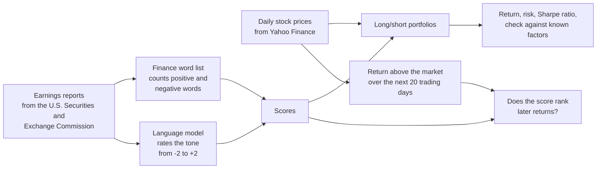

# Can a language model read earnings reports well enough to predict stock returns?

Every three months, each public company publishes an earnings report: a press
release with its results and what management expects next. This project asks a
language model (Claude, the same kind of artificial intelligence as ChatGPT) to
read 525 of these reports and rate how upbeat or gloomy management sounds. It
then checks whether those ratings predict how the stock does over the following
month, and whether the model does better than a classic method that simply
counts positive and negative words.

---

## In short

**The main test, chosen before any data were analysed:** does the model's tone
score rank stocks by how well they do over the next 20 trading days (about one
month)? It did, a little. The rank correlation was **+0.08** (0 means no link),
and it was positive in 8 of 10 earnings seasons. The classic word-counting
method scored **−0.04**, no better than chance. But with only 10 seasons the
result falls just short of the usual bar for statistical significance
(p = 0.08), and the pre-chosen trading strategy, rebalanced after each earnings
season, made little after costs.

**The most interesting pattern (exploratory):** the effect appears in the first
few days after a report and then fades. Trades placed right after each report
did much better than the seasonal strategy, which trades about five weeks
later. That version holds only a few stocks at a time, so it is fragile.

**The clean test does not confirm a lasting effect.** Claude learned from
internet text up to June 2026, *after* every report in this study, so it may
have read how these stocks moved. To check, the same reports were scored by
Llama 3.2, a smaller model whose training data ends in December 2023. On the
417 reports from 2024 and 2025, which Llama cannot have read about, no score
predicted returns: Claude +0.04, Llama +0.02, the word list −0.05, none of them
statistically significant. Almost all of Claude's overall result comes from
the 108 reports of late 2023 (+0.23). Memory, a period when tone mattered more,
or chance could each explain that; this sample cannot tell them apart. See the
[clean test](#clean-test-an-older-model-that-cannot-have-seen-what-happened).


## Key results in plain words

| Question | Answer |
|---|---|
| Does the model's tone score line up with the next month's returns? | Yes, a little: a rank correlation of +0.08, positive in 8 of 10 earnings seasons. The finance word list scored −0.04. |
| Is that just luck? | It might be. The t-statistic was 1.98; with only 10 seasons, the usual 5% significance bar is about 2.26. The p-value was 0.08, so there is roughly an 8% chance of a result this strong with no real link. |
| How big was the difference in returns? | The most upbeat fifth of reports beat the market by 0.41% over 20 days; the most gloomy fifth trailed it by 0.57%. |
| Could you have made money trading on it? | Not with the pre-chosen strategy: rebalancing after each earnings season gave a Sharpe ratio of only 0.21 after costs. Trading right after each report looked much better (Sharpe ratio 1.41), but that is exploratory and rests on just 2 or 3 stocks on each side on a typical day, so its margin of error is about ±0.9. |
| How long does the effect last? | A few days. Starting the same trades 5 trading days later cut the Sharpe ratio from 1.41 to 0.45, and 10 days later it turned negative. |
| Which part of the report mattered most? | What management said about **future guidance**, and how that changed since the previous quarter, had the strongest results. Comments on **customer demand** showed nothing. None of the topics is significant on its own. |
| Did it hold up on reports a model could not have read about? | No. On the 417 reports from 2024 and 2025, Claude's correlation was +0.04 (p = 0.36) and Llama's +0.02 (p = 0.64). The overall result rests mostly on late 2023. |
| Does the model give the same answer twice? | Yes. Scoring the same reports a second time gave the identical guidance rating 80% of the time, and it was never more than one step apart. |

## What the numbers mean

| Term | Plain meaning |
|---|---|
| Earnings report | A company's press release with its quarterly results, filed with the U.S. Securities and Exchange Commission as a "Form 8-K". |
| Tone score | The model's rating from −2 (clearly negative, for example guidance cut) to +2 (clearly positive, for example guidance raised). |
| Return above the market | The stock's return minus the return of an S&P 500 index fund over the same days. It removes the effect of the whole market going up or down. |
| Information coefficient | How well a score *ranks* stocks by their later returns. A rank correlation from −1 to +1; 0 means no link. In investing, +0.05 to +0.10 is considered useful. |
| t-statistic | How far a result is from zero, measured in units of its own uncertainty. The bar for "unlikely to be chance" depends on the amount of data: with 10 earnings seasons it is about 2.26. |
| p-value | The chance of seeing a result at least this strong if there were really no link. Below 0.05 is the usual bar for "statistically significant". |
| Standard error | The typical size of the error in an estimate. A Sharpe ratio of 1.4 with a standard error of 0.9 could easily be anywhere from about 0.5 to 2.3. |
| Hit rate | How often the most upbeat and most gloomy fifths moved the way their score predicted. 50% is a coin flip. |
| Long/short portfolio | Buy the stocks with the most upbeat reports and sell short (bet against) those with the most gloomy reports. It makes money if the first group beats the second, whatever the overall market does. |
| Sharpe ratio | Return earned per unit of risk taken. Above 1 is good; the stock market as a whole is usually around 0.4 to 0.6. |
| Maximum drawdown | The worst fall from a high point to a later low point. |
| Fama-French factors | Well-known drivers of stock returns (the overall market, company size, cheap versus expensive stocks, profitability, investment, and recent winners or "momentum"). Checking against them shows whether a strategy is just repeating a known pattern. |
| Alpha | The part of a strategy's return that those known factors cannot explain. |
| Training cutoff | The date up to which the language model learned from text. Anything before it, the model may already have read about. |

---

## Detailed results

The section below is written automatically by `earnsig report` from the files in
[`results/`](results/).

<!-- RESULTS:START -->

> [!CAUTION]
> **Every report in this sample is older than the language model's training cutoff (2026-06-30).** The model may have read news about how these stocks moved
> after each report, so a good result here can come from memory rather than reading skill.
> Treat it as a best case. A clean test needs a model trained before the reports were published
> (see *Biases and limitations* below).

_Sample: 525 earnings reports from 50 companies, 2023-07-07 to 2025-12-23. Scored by: Claude (claude-haiku-5-5), exact model `llama3.2:3b (digest a80c4f17acd5)`. Returns are measured above the S&P 500 index fund (SPY). Trading costs: 0.10% per trade plus 0.50% a year to borrow shares for selling short._

### Main test (chosen before the data were analysed)

The `llm` score (future-guidance tone, with the other topics as a tie-breaker), its information coefficient against the 20-day return above the market, and a long/short portfolio rebalanced after each earnings season. These choices were fixed in the settings before any real report was scored.

| Main test | Language model tone | Finance word list |
|---|---:|---:|
| Information coefficient: rank correlation of the score with the 20-day return above the market | +0.082 | -0.038 |
| t-statistic across 10 seasons (5% significance needs about 2.26 with this few seasons) | 1.98 | -0.74 |
| p-value (chance of a result this strong if there were no real link; below 0.05 is the usual bar) | 0.08 | 0.48 |
| Earnings seasons where the correlation was positive | 80% of 10 | 50% of 10 |
| Portfolio rebalanced each season, after costs: Sharpe ratio (± one standard error) | 0.21 (± 0.64) | -0.27 (± 0.65) |

**Verdict on the main test:** the language model's score was positively linked to later returns (information coefficient +0.082), but the link is **not** statistically significant at the usual 5% level (p = 0.08), and the pre-chosen seasonal portfolio made little after costs. Treat the result as suggestive, not proven.

### Exploratory results

Everything below was examined after seeing the data. With this many variations, some will look good by luck, so none of it should be read as a finding on its own.

**The 20-day portfolio.** Holding each report for 20 trading days looks much better than the main portfolio, but it is fragile: on a typical day it holds only a few stocks on each side, and on some days only one side, so its Sharpe ratio has a wide margin of error (shown below).

**Why the two portfolios differ.** The link between tone and returns shows up in the first few days after a report. Starting the same trades later shows how fast it fades; the seasonal portfolio typically trades 36 calendar days after a report, after the effect has mostly gone. These five numbers are themselves noisy, so read the pattern, not each value.

| Trades start this many trading days later | 0 | 5 | 10 | 20 | 40 |
|---|---:|---:|---:|---:|---:|
| Sharpe ratio after costs | 1.41 | 0.45 | -0.60 | -0.02 | 0.43 |

#### All measures

| Measure | Language model tone | Finance word list |
|---|---:|---:|
| Reports with a score | 525 | 525 |
| Information coefficient: rank correlation of score with the 20-day return above the market | +0.082 | -0.038 |
| t-statistic of the information coefficient across seasons | 1.98 | -0.74 |
| p-value | 0.08 | 0.48 |
| Earnings seasons where the correlation was positive | 80% of 10 | 50% of 10 |
| Hit rate: top and bottom fifth that moved the predicted way | 55.5% | 52.6% |
| Average 20-day return above the market, most upbeat fifth / most gloomy fifth | 0.41% / -0.57% | -0.27% / 0.12% |
| **Long/short portfolio, rebalanced each season, after costs:** yearly return | 2.7% | -3.3% |
| Yearly volatility (typical size of ups and downs) | 12.8% | 12.3% |
| Sharpe ratio (return per unit of risk), after costs (before costs) | 0.21 (0.32) | -0.27 (-0.19) |
| Standard error of that Sharpe ratio | 0.64 | 0.65 |
| Maximum drawdown (worst fall from a peak) | -18.1% | -19.9% |
| Turnover per rebalance (replacing every holding = 400%) | 212% | 118% |
| Holding periods that made money | 60% | 60% |
| **Long/short portfolio, each report held 20 trading days, after costs:** Sharpe ratio (± one standard error) | 1.41 (± 0.92) | -0.94 (± 0.77) |
| Maximum drawdown | -14.3% | -46.6% |
| Stocks held on a typical day, long / short | 2 / 3 | 2 / 2 |
| Days with only one side held (other side hedged with the market fund) | 23% | 20% |
| Alpha against the factors, yearly (t-statistic) | 23.0% (1.90) | -30.4% (-2.32) |
| **Fama-French five factors plus momentum, seasonal portfolio:** alpha, yearly return not explained by the factors (t-statistic) | 1.5% (0.22) | -7.6% (-1.20) |
| Market beta (sensitivity to the overall stock market) | -0.09 | +0.22 |
| Size / value / profitability / investment betas | -0.18 / -0.25 / -0.19 / +0.02 | +0.08 / -0.23 / -0.06 / -0.01 |
| Momentum beta (tendency to hold recent winners) | +0.20 | +0.20 |
| R-squared (share of the ups and downs explained by the factors) | 0.23 | 0.28 |
| Information coefficient using only reports after the model's training cutoff (number of reports) | none: every report is older than the cutoff | none: every report is older than the cutoff |


#### Which topic matters most?

Each report also got separate scores for what management said about future guidance, profit margins and customer demand.

| Score | Information coefficient | t-statistic | Hit rate | Sharpe ratio, seasonal portfolio | Sharpe ratio, 20-day portfolio |
|---|---:|---:|---:|---:|---:|
| Language model tone | +0.082 | 1.98 | 55.5% | 0.21 | 1.41 |
| Language model: guidance | +0.059 | 1.67 | 56.0% | 0.27 | 1.55 |
| Language model: margins | +0.067 | 1.07 | 58.4% | 0.51 | 0.56 |
| Language model: demand | -0.007 | -0.18 | 48.8% | 0.77 | -0.05 |
| Language model: overall tone | +0.067 | 1.17 | 54.1% | 0.52 | 0.52 |
| Language model: change since last quarter | +0.072 | 1.73 | 56.1% | 1.12 | 0.21 |
| Finance word list | -0.038 | -0.74 | 52.6% | -0.27 | -0.94 |


#### Does the model give the same answer twice?

The same 40 reports were scored twice with identical inputs.

| Score | Same score both times | Within one step | Rank correlation | Agreement beyond chance (weighted kappa, 1 = perfect) |
|---|---:|---:|---:|---:|
| Guidance tone | 80% | 100% | 0.84 | 0.86 |
| Overall tone | 78% | 100% | 0.86 | 0.83 |
| Margins tone | 90% | 100% | 0.95 | 0.95 |
| Demand tone | 80% | 100% | 0.91 | 0.92 |

<!-- RESULTS:END -->

---

<!-- CLEAN_TEST:START -->

## Clean test: an older model that cannot have seen what happened

The main results use Claude (claude-haiku-5-5), which learned from text written after every report in the sample. Here the same reports are scored by Llama (llama3.2:3b, run with Ollama), whose training data ends on 2023-12-31, so for reports published after that date it cannot have read how the stock moved. If its score still predicts returns on those reports, the effect is more likely to be real reading skill; if it does not, memory is the likelier explanation for the main result. One caution: the second model is much smaller, so a weaker result can also mean it simply reads less well.

| Measure | Claude (claude-haiku-5-5) | Llama (llama3.2:3b, run with Ollama) | Finance word list |
|---|---:|---:|---:|
| Training data ends | 2026-06-30 | 2023-12-31 | not applicable |
| Reports scored | 525 | 525 | 525 |
| Reports published after the model's training data ends | 0 | 417 | not applicable |
| Information coefficient, all reports (rank correlation with the 20-day return above the market) | +0.082 | +0.029 | -0.038 |
| t-statistic across seasons (5% significance needs about 2.26) | 1.98 | 0.79 | -0.74 |
| p-value | 0.08 | 0.45 | 0.48 |
| Hit rate (top and bottom fifth that moved the predicted way) | 55.5% | 47.8% | 52.6% |
| Sharpe ratio, each report held 20 trading days, after costs | 1.41 | -0.49 | -0.94 |
| Sharpe ratio, rebalanced each season, after costs | 0.21 | -0.08 | -0.27 |
| **Information coefficient using only reports the model could not have read about** | **none: it may have read about every report** | **+0.023 (417 reports)** | not applicable |

**The same comparison split at the second model's training cutoff** (rank correlation of each score with the 20-day return above the market, pooled across reports, with its p-value):

| Period | Reports | Claude (claude-haiku-5-5) | Llama (llama3.2:3b, run with Ollama) | Finance word list |
|---|---:|---:|---:|---:|
| Up to the end of December 2023 (second model may have read about these) | 108 | +0.229 (p 0.02) | +0.085 (p 0.38) | +0.036 (p 0.71) |
| After December 2023 (second model cannot have read about these) | 417 | +0.045 (p 0.36) | +0.023 (p 0.64) | -0.046 (p 0.34) |

_How often the two models agree, on the same 525 reports: identical guidance score 26% of the time, within one step 73%; rank correlation of their scores 0.39._

Full tables and charts for the second model: [`results/llama/`](results/llama/).

<!-- CLEAN_TEST:END -->

---

## How the study works



### 1. Collecting the reports
`earnsig collect` downloads every earnings report for each company in
[`config/universe.csv`](config/universe.csv) (50 large U.S. companies across all
11 sectors) from EDGAR, the Securities and Exchange Commission's public filing
database. It looks for Form 8-K filings marked "Item 2.02, Results of Operations
and Financial Condition", takes the attached press release (exhibit 99.1),
removes the web formatting and records the exact time the filing went public.
Earnings-call transcripts can be used instead with
`earnsig collect --source local --manifest transcripts.csv` (columns
`ticker, published_at, path`), if you have access to them.

### 2. Scoring the tone with a language model
Each report is read once by the model using a fixed set of instructions
([`llm_score.py`](src/earnsig/llm_score.py)). The model must answer in a fixed
structured format (JSON, a standard text format for data) with whole-number
scores from −2 to +2 for **future guidance**, **profit margins**, **customer
demand** and **overall tone**, a yes/no flag for whether each topic is
mentioned, and a one-line reason. Before scoring, the company name, stock
ticker and all dates are hidden, to make it harder for the model to recognise
the company and recall what happened next. Every answer is saved in
`data/llm_cache.jsonl`, so re-running costs nothing and every score can be
checked. `earnsig consistency` scores a random sample a second time and
measures how often the answers match.

**No paid account is needed.** Choose how the reports are scored with
`llm.provider` in [`config/config.yaml`](config/config.yaml):

| Option | What you need | Cost |
|---|---|---|
| `claude_code` (default) | [Claude Code](https://code.claude.com), signed in with a Claude Pro or Max subscription | Included in the subscription; uses its normal usage limits |
| `ollama` | [Ollama](https://ollama.com) and a downloaded model, for example `ollama pull llama3.2:3b` (about 2 gigabytes; runs on a Mac with 8 gigabytes of memory) | Free; runs on your own computer |
| `anthropic` | A key for Anthropic's paid programming interface | Pay per use (optional, not needed) |

With `claude_code`, a large batch of reports may not fit within one usage
period. When the limit is reached, scoring stops cleanly, and running
`earnsig score` again after the limit resets carries on where it stopped. The
Haiku model uses the least of the allowance.

With `ollama`, an older model is an advantage: Llama 3.2 learned from text up to
December 2023, so it cannot have read about 2024 and 2025 stock moves. The
ready-made settings in [`config/llama.yaml`](config/llama.yaml) score the same
reports with it and keep its results separate in `results/llama/`. Small local
models read less accurately than Claude, so comparing the two is a useful
experiment in itself.

The score used for trading (`llm`) is the guidance score, with the average of
the other three scores added at one tenth of the weight to break ties, because
five possible values produce many ties. `llm_delta` is the change in guidance
score since the same company's previous report.

### 3. The comparison method: a finance word list
`lm` counts words from the Loughran-McDonald word lists, a standard set of
positive and negative words built specifically for financial documents. The
score is (positive − negative) ÷ (positive + negative), and a positive word
preceded by "not", "no" or "never" counts as negative. To use the official list,
put its file at `data/external/lm_master_dictionary.csv`; otherwise the copy
included with the `pysentiment2` Python package is used.

### 4. Measuring returns without peeking ahead
The first day a trade is possible ("day 0") is **the first trading day whose
4 p.m. New York closing price comes after the report was published**: a report
released at 7 a.m. can be traded at that day's close, one released at 4:05 p.m.
at the next day's close. Positions start at the day-0 close, so the study
**never counts the immediate price jump on the day of the report**; it only
counts what happens over the next 20 trading days. The return above the market
is the stock's return minus that of the S&P 500 index fund (SPY), or minus the
stock's sector fund with `event.benchmark: sector`. These rules are checked by
automated tests in [`tests/test_events.py`](tests/test_events.py).

### 5. The two portfolios
* **Rebalanced after each earnings season (main test).** On the first trading
  day of March, June, September and December, rank the stocks by the score of
  their most recent report published *before* that day. Buy the top fifth, sell
  short the bottom fifth, in equal amounts, and hold until the next rebalance.
* **Each report held for 20 trading days (exploratory).** Every report opens a
  position for the 20 trading days after it. Whether it counts as "upbeat" or
  "gloomy" is decided by comparing it only with reports published *earlier*,
  because later reports in the same season are not yet known at that point.

The two answer different questions. The seasonal portfolio often trades weeks
after a report (a report from late January is first traded on March 1), so it
only works if tone predicts returns for several months. The 20-day portfolio
tests the month right after the report directly. In this study the effect
showed up in the 20-day portfolio and mostly faded in the seasonal one, which
trades a median of 36 days after each report. Delaying the 20-day trades by 5
to 10 trading days removes most of the effect, so the market seems to catch up
within about a week.

The 20-day portfolio is also thin: with 50 companies reporting over a few weeks,
only about a fifth of the reports open at any time fall in each extreme group,
so on a typical day it holds 2 or 3 stocks on each side, and on about a quarter
of days only one side (the other side is then hedged with the S&P 500 fund).
Each side is equally weighted across the stocks it holds, and days with nothing
held count as zero return.

Trading costs: 0.10% of the amount traded each time a position changes, plus
0.50% a year to borrow the shares sold short. Both can be changed in the
settings.

### 6. How the results are measured
| Measure | How it is calculated |
|---|---|
| Information coefficient | Rank correlation (Spearman) between the score and the 20-day return above the market, calculated within each earnings season and then averaged; the t-statistic uses the spread across seasons |
| Hit rate | Share of top-fifth reports followed by a return above the market, plus bottom-fifth reports followed by a return below it |
| Sharpe ratio | Yearly average return divided by yearly volatility of the daily long/short returns (no risk-free rate is subtracted, because buying and selling short in equal amounts needs no net money) |
| Maximum drawdown | Largest fall from a high point to a later low point of the long/short portfolio's value |
| Factor check | Ordinary least squares regression of the daily long/short returns on the Fama-French five factors plus momentum, with standard errors adjusted for patterns across neighbouring days (Newey-West, 5 days) |
| After-cutoff information coefficient | The same correlation, using only reports published after the model's training cutoff |

---

## Run it yourself

```bash
git clone https://github.com/pooja003-cloud/llm-earnings-signal && cd llm-earnings-signal
python -m venv .venv && source .venv/bin/activate
pip install -e ".[dev]"
pytest -q                      # 58 automated tests, about 3 seconds

earnsig demo --readme          # practice run on made-up data, no internet needed, about 20 seconds
```

Full run (free; no paid account):

```bash
cp .env.example .env           # set SEC_USER_AGENT="Your Name you@email.com" (the SEC asks every downloader to identify itself)
claude                         # once: sign in with your Claude Pro account, then type /exit
earnsig prices                 # daily stock prices from Yahoo Finance
earnsig factors                # Fama-French factor data from Kenneth French's website
earnsig collect                # earnings reports from the SEC (about 15 to 20 minutes)
earnsig score --dry-run        # shows how many reports will be scored
earnsig score --limit 20       # try a few first; answers are saved in data/llm_cache.jsonl
earnsig score                  # run again after each usage reset until everything is scored
earnsig consistency            # score 40 reports a second time
earnsig baseline               # finance word list scores
earnsig backtest               # all calculations and charts
earnsig report                 # writes the "Detailed results" section of this page
```

Clean test with an older model, free on your own computer (needs
[Ollama](https://ollama.com); about 3 to 4 hours for 525 reports on a Mac with
8 gigabytes of memory):

```bash
brew install ollama && brew services start ollama
ollama pull llama3.2:3b
earnsig --config config/llama.yaml score        # resumes if stopped
earnsig --config config/llama.yaml consistency
earnsig --config config/llama.yaml backtest     # results go to results/llama/
earnsig --config config/llama.yaml compare      # adds the "Clean test" section to this page
```

No suitable computer? The notebook
[`notebooks/llama_clean_test_colab.ipynb`](notebooks/llama_clean_test_colab.ipynb)
does the scoring on a free Google Colab machine with a graphics card in about
half an hour ([open it in Colab](https://colab.research.google.com/github/pooja003-cloud/llm-earnings-signal/blob/main/notebooks/llama_clean_test_colab.ipynb));
then run the last two commands above on your own computer.

Or run everything with `make all`. All settings are in
[`config/config.yaml`](config/config.yaml): the scoring model, the period
studied (`analysis_start`, `end_date`), the comparison fund, the holding period,
trading costs, rebalance months and the model's **training cutoff**, which you
should set to the published date for whichever model you use.

## What is in this repository

```
config/            list of companies (universe.csv) and all settings (config.yaml)
src/earnsig/
  collect.py       downloads earnings reports from the SEC; loads your own transcripts
  market_data.py   stock prices from Yahoo Finance; Fama-French factor data
  llm_score.py     scoring instructions, answer format, hiding names and dates, saved answers, consistency check
  lm_baseline.py   finance word list scores (Loughran-McDonald)
  events.py        finds the first day a trade is possible and measures returns above the market
  portfolio.py     the two long/short portfolios
  metrics.py       information coefficient, hit rate, Sharpe ratio, drawdown, factor check
  analysis.py      runs every calculation and writes results/
  figures.py       the charts on this page
  report.py        writes the "Detailed results" section of this page
  synthetic.py     made-up data for the practice run
tests/             automated checks, including the no-peeking-ahead rules
results/           all result tables, daily returns, holdings, scored reports and charts
```

---

## Biases and limitations

Read this before trusting any number above.

**The language model may already know what happened.** This is the biggest
problem. A model that learned from text written after a report may have read
news about how the stock reacted, and can "rate" the report with that hindsight.
Hiding the company name and dates helps a little, but distinctive products,
figures and wording can still give a company away. The only clean test uses
reports published after the model's training cutoff, shown in the last row of
the main results table.

For Claude that test is impossible: Claude Haiku 5.5 learned from text up to
June 2026, and every report is from July 2023 to December 2025. So the same
reports were also scored by an older model, Llama 3.2 (3 billion parameters,
training data up to December 2023), run free through Ollama; 417 of the 525
reports are new to it. The [clean test](#clean-test-an-older-model-that-cannot-have-seen-what-happened)
shows that on those 417 reports no score predicts returns, and that Claude's
own result on them is also weak (+0.04). Llama did better on the reports it
could have read about (+0.09) than on those it could not (+0.02), which fits
the memory explanation, but with only 108 earlier reports that difference could
also be chance. Llama is also a much smaller model, so part of its weaker result
may be weaker reading.

**A small sample.** 50 companies over about 10 quarters is 525 reports and only
10 earnings seasons, so every number has a wide margin of error. With 10
seasons, a t-statistic needs to reach about 2.26 (not the familiar 2) for 5%
significance. A Sharpe ratio measured over two and a half years has a standard
error of about 0.6 to 0.9, as the results tables show.
All 1,041 reports since 2021 have been downloaded; set `analysis_start` equal
to `start_date` in the settings to use them all.

**Only today's survivors.** The list is today's large companies. Companies that
failed, were bought or became smaller since 2021 are missing, which can make
results look better or worse than they really were. The effect on this study
is probably modest, because both sides of every trade come from the same list
of survivors, and all 50 were already large, established companies in 2021.
But it cannot be measured without the historical list. A stricter study would
use the S&P 500 membership as it stood at each date.

**Only the weeks after the report are tested.** Skipping the price jump on the
report day is deliberate, because nobody can trade before the report is public.
It does mean that a weak result here would not show that the model reads tone
badly, only that the market reacts quickly.

**Timing of filings.** The time a filing appears on the SEC's website can be
minutes to hours later than the press release on news services. That makes the
study's "first chance to trade" a little late, if anything, which is the safe
direction to be wrong in.

**Simplified trading costs.** A flat 0.10% per trade and 0.50% a year for
borrowing are reasonable for large, heavily traded companies, but ignore the
extra cost of trading large amounts or on busy earnings days. Results are shown
both before and after costs.

**Many variations.** Six language model scores, one word-list score, two
portfolios and several settings add up to many possible versions, and some
will look good by luck. The main test was fixed in the settings before any real
report was scored: the `llm` score (guidance tone, with the other topics as a
tie-breaker), its information coefficient against the 20-day return above the
market, and the portfolio rebalanced after each earnings season. Everything else
is labelled exploratory.

**Sensitivity to the instructions and the model.** Scores depend on how the
instructions are worded and which model version reads them. The instruction
version (`prompt_version`) is stored with every saved answer; change it whenever
the instructions change. The main results used `claude-haiku-5-5`, the model the
`haiku` setting pointed to on 9 October 2026; new runs record the exact model
identifier with every saved answer, so a later change of model is visible.

**Data terms.** Filings from the Securities and Exchange Commission are public.
Yahoo Finance data is for personal use, so the downloaded prices and reports
(the `data/` folder) are not uploaded to this repository. The Loughran-McDonald
word lists have their own terms of use (free for academic use).
