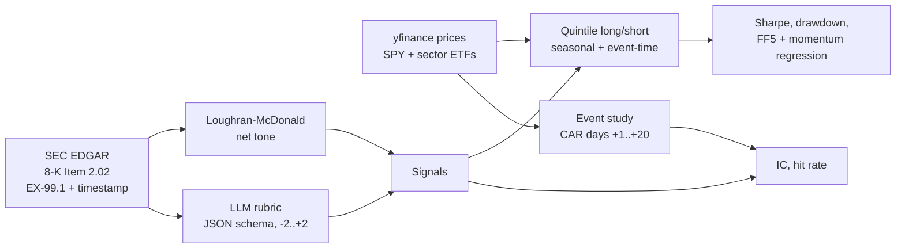

# Does LLM-scored earnings tone predict stock returns?

An event study and long/short backtest that asks a narrow question: **after an
earnings release is public, does an LLM's reading of management's tone predict
the stock's abnormal return over the next 20 trading days**, and does it beat a
classic finance dictionary (Loughran-McDonald)?

The pipeline pulls 8-K earnings press releases from SEC EDGAR for 50 large US
stocks (July 2023 to December 2025, about 520 releases), has an LLM score each one on a fixed -2..+2 rubric with
JSON-schema output, measures post-announcement abnormal returns, and trades a
quintile long/short portfolio rebalanced after each earnings season.

> **Status.** The code, tests and synthetic demo run end to end. The results
> section below is produced by `earnsig report`; until you run the real
> pipeline it shows the **synthetic demo** and is labeled as such. The live
> downloaders (SEC EDGAR, yfinance, Ken French) are unit-tested on sample
> responses but have not yet been run against the live services, so the first
> real `collect` may need small fixes.

---

## Results

<!-- RESULTS:START -->

> [!CAUTION]
> **Every document in this sample predates the scorer's training cutoff (2026-06-30).** The model may have read news about how these stocks moved
> after each release, so a positive result here can reflect memory rather than reading skill.
> Treat it as an upper bound. A clean test needs a model trained before the sample period
> (see *Biases* below).

_Sample: 525 documents, 50 stocks, 2023-07-07 to 2025-12-23. Scorer: `Claude Code (haiku)`. Abnormal returns vs. market benchmark. Costs: 10 bps one-way + 50 bps/yr borrow._


### Summary statistics

| Metric | LLM tone | Loughran-McDonald |
|---|---:|---:|
| Documents with a score | 525 | 525 |
| Mean IC (Spearman vs. CAR[+1,+20]) | +0.082 | -0.038 |
| IC t-stat (across seasons) | 1.98 | -0.74 |
| Seasons with positive IC | 80% of 10 | 50% of 10 |
| Hit rate (extreme quintiles) | 55.5% | 52.6% |
| Mean CAR, top / bottom quintile | 0.41% / -0.57% | -0.27% / 0.12% |
| **Seasonal L/S, net:** annual return | 2.7% | -3.3% |
| Annual volatility | 12.8% | 12.3% |
| Sharpe ratio, net (gross) | 0.21 (0.32) | -0.27 (-0.19) |
| Max drawdown | -18.1% | -19.9% |
| Turnover per rebalance (full swap = 400%) | 212% | 118% |
| Holding periods with a gain | 60% | 60% |
| **Event-time L/S (days +1..+20), net:** Sharpe | 1.41 | -0.94 |
| Max drawdown | -14.3% | -46.6% |
| **FF5 + momentum:** alpha, annual (t) | 1.5% (0.22) | -7.6% (-1.20) |
| Market beta | -0.09 | +0.22 |
| SMB / HML / RMW / CMA | -0.18 / -0.25 / -0.19 / +0.02 | +0.08 / -0.23 / -0.06 / -0.01 |
| Momentum beta | +0.20 | +0.20 |
| R² of factor regression | 0.23 | 0.28 |
| Pooled IC after LLM training cutoff (n) | none: all documents predate the cutoff | none: all documents predate the cutoff |


### Which topic matters most? (stretch goal)

| Signal | Mean IC | IC t-stat | Hit rate | Seasonal L/S Sharpe (net) | Event-time L/S Sharpe (net) |
|---|---:|---:|---:|---:|---:|
| LLM tone | +0.082 | 1.98 | 55.5% | 0.21 | 1.41 |
| LLM: guidance | +0.059 | 1.67 | 56.0% | 0.27 | 1.55 |
| LLM: margins | +0.067 | 1.07 | 58.4% | 0.51 | 0.56 |
| LLM: demand | -0.007 | -0.18 | 48.8% | 0.77 | -0.05 |
| LLM: overall | +0.067 | 1.17 | 54.1% | 0.52 | 0.52 |
| LLM: change vs. prior | +0.072 | 1.73 | 56.1% | 1.12 | 0.21 |
| Loughran-McDonald | -0.038 | -0.74 | 52.6% | -0.27 | -0.94 |


### Scoring consistency (same document, scored twice)

Scored 40 documents twice with identical inputs.

| Score | Exact agreement | Within ±1 | Spearman | Weighted kappa |
|---|---:|---:|---:|---:|
| guidance tone | 80% | 100% | 0.84 | 0.86 |
| overall tone | 78% | 100% | 0.86 | 0.83 |
| margins tone | 90% | 100% | 0.95 | 0.95 |
| demand tone | 80% | 100% | 0.91 | 0.92 |

<!-- RESULTS:END -->

---

## How it works



### 1. Documents and event times
`earnsig collect` finds every 8-K with **Item 2.02** (Results of Operations) for
each ticker in [`config/universe.csv`](config/universe.csv), downloads the
EX-99.1 exhibit (the press release), strips the HTML, and records EDGAR's
**acceptance timestamp**. Earnings-call transcripts can be added instead with
`earnsig collect --source local --manifest transcripts.csv` (columns
`ticker, published_at, path`), if you have a licensed source.

### 2. LLM scoring
Each document is scored in one call with a fixed rubric
([`llm_score.py`](src/earnsig/llm_score.py)) and a strict JSON schema
(structured outputs), returning integer scores in {-2..+2} for **guidance**,
**margins**, **demand** and **overall** tone, a "mentioned" flag per topic, and
a one-line reason. Before scoring, the company name, ticker and all dates are
masked to make it harder for the model to recall what happened next. Every
response is cached to `data/llm_cache.jsonl`, so re-runs are free and every
score is auditable. `earnsig consistency` re-scores a random sample and reports
exact agreement, within-one agreement, Spearman and quadratic-weighted kappa.

**No API key needed.** Pick the scoring backend with `llm.provider` in
[`config/config.yaml`](config/config.yaml):

| Provider | What you need | Cost |
|---|---|---|
| `claude_code` (default) | [Claude Code](https://code.claude.com) installed and signed in with a Claude Pro or Max plan | Included in the plan; uses your normal usage limits |
| `ollama` | [Ollama](https://ollama.com) and a pulled model, e.g. `ollama pull llama3.1:8b` (about 5 GB; 16 GB RAM recommended) | Free, runs on your computer |
| `anthropic` | An API key from the Claude Console | Pay per token (optional, not needed) |

With `claude_code`, each document is one `claude -p` call with no tools, a
replaced system prompt and `--json-schema`. ~1,000 releases will not fit in one
usage window: when the limit is hit, scoring stops cleanly, and running
`earnsig score` again after the reset picks up where it left off. Haiku uses
the least of your allowance.

With `ollama`, a model with an old, published training cutoff is a feature:
Llama 3.1's data ends in December 2023, so every 2024-2025 event is genuinely
out of sample for it (set `training_cutoff: "2023-12-31"`). Small local models
read less accurately than Claude, so running both and comparing is a good
experiment in itself.

Signal used for trading (`llm`): the guidance score, with the other three
scores averaged and added at 0.1x as a tie-breaker, because five integer levels
tie heavily and quintiles need an order. `llm_delta` is the change in guidance
score versus the same company's previous release.

### 3. Baseline
`lm` = (positive − negative) / (positive + negative) word counts from the
Loughran-McDonald master dictionary, with LM's simple negation rule. Put the
official CSV at `data/external/lm_master_dictionary.csv`; otherwise the copy
bundled with `pysentiment2` is used.

### 4. Abnormal returns (the look-ahead guard)
Day 0 is **the first trading day whose 16:00 ET close comes after
publication**: a 07:00 release trades at that day's close, a 16:05 release at
the next day's close. Positions are entered at the day-0 close, so the strategy
**never earns the day-0 reaction**; it can only capture drift on days +1..+20.
Abnormal return = stock return − SPY (or the sector ETF with
`event.benchmark: sector`). EDGAR timestamps are read as Eastern wall-clock
time; if they were really UTC this would only delay entries, never make them
early. These rules are covered by [`tests/test_events.py`](tests/test_events.py).

### 5. Portfolios
* **Seasonal (main).** On the first trading day of March, June, September and
  December (after each reporting season), rank stocks by the signal from their
  latest release published *before* that day. Long the top quintile, short the
  bottom, equal weight, hold to the next rebalance.
* **Event-time (robustness).** Each release opens a position for days +1..+20.
  Membership uses quintile breakpoints from releases published *earlier* only,
  since later reporters in the same season are unknown at the time.

The two answer different questions. The seasonal book enters weeks after most
releases (a late-January release is first traded on March 1), so it only pays
off if tone predicts returns for months. The event-time book tests the 20-day
window directly. In the synthetic demo, where the planted drift lasts exactly
20 days, the event-time book captures it and the seasonal book does not; real
data will tell you how long any effect persists.

Costs: 10 bps one-way per unit of turnover plus 50 bps a year to borrow the
short leg (both configurable).

### 6. Statistics
| Metric | Definition |
|---|---|
| Information coefficient (IC) | Spearman correlation of signal with CAR[+1,+20] within each season, averaged; t-stat across seasons |
| Hit rate | Share of top-quintile events with CAR > 0 plus bottom-quintile events with CAR < 0 |
| Sharpe | Annualized mean / annualized volatility of daily long/short returns (self-financing, so no risk-free subtraction) |
| Max drawdown | Largest peak-to-trough fall of the cumulative long/short value |
| Factor exposures | OLS of daily long/short returns on Fama-French 5 factors + momentum, Newey-West (5 lags) |
| Post-cutoff IC | Pooled IC using only events after the model's training cutoff |

---

## Quick start

```bash
git clone https://github.com/pooja003-cloud/llm-earnings-signal && cd llm-earnings-signal
python -m venv .venv && source .venv/bin/activate
pip install -e ".[dev]"
pytest -q                      # 40 tests, ~3 s

earnsig demo --readme          # offline, synthetic data, ~20 s
```

Real run (everything here is free; no API key):

```bash
cp .env.example .env           # set SEC_USER_AGENT="Your Name you@email.com"
claude                         # once: sign in with your Claude Pro account, then exit
earnsig prices                 # yfinance, adjusted closes
earnsig factors                # Ken French data library
earnsig collect                # 50 tickers x ~20 quarters of 8-Ks (≈ 15-20 min at SEC's rate limit)
earnsig score --dry-run        # how many documents and tokens
earnsig score --limit 20       # try a few first, read data/llm_cache.jsonl
earnsig score                  # re-run after each usage reset until all are scored
earnsig consistency            # re-score 40 documents
earnsig baseline
earnsig backtest
earnsig report                 # rewrites the Results section above
```

Or `make all`. Settings live in [`config/config.yaml`](config/config.yaml):
model, sample period, benchmark, holding window, costs, rebalance months and
the model's **training cutoff**, which you should set to the published cutoff
of whichever model you use. To shrink the job, cut the universe in
`config/universe.csv` or shorten the date range; 50 stocks over 3 years is
about 600 documents.

## Repository layout

```
config/            universe (ticker, name, sector ETF) and settings
src/earnsig/
  collect.py       SEC EDGAR 8-K Item 2.02 downloader, local transcript loader
  market_data.py   yfinance prices, Fama-French factors
  llm_score.py     rubric, JSON schema, anonymization, caching, consistency check
  lm_baseline.py   Loughran-McDonald net tone
  events.py        day-0 alignment and abnormal returns
  portfolio.py     seasonal and event-time long/short books
  metrics.py       IC, hit rate, Sharpe, drawdown, factor regression
  analysis.py      runs everything, writes results/
  figures.py       README charts
  report.py        writes the Results section of this README
  synthetic.py     fake data for the offline demo
tests/             look-ahead, portfolio, scoring and metric tests
results/           summary.csv, daily returns, holdings, scored events, figures
```

---

## Biases, limitations and costs (read before believing any number)

**The LLM may already know the answer.** This is the biggest problem. Any model
trained on data after an event may have read news about the earnings reaction
and the stock's later moves, and can "score" a release with that hindsight.
Masking names and dates helps a little; distinctive products, figures and
phrasing can still identify a company. The only clean test is on events after
the model's training cutoff, reported separately as **post-cutoff IC**. With a
recent model that window may be short and the sample small. Treat pre-cutoff
results as an upper bound, not evidence.

In this run the problem is total: Claude Haiku 5.5's training data runs to June
2026 and every release in the sample is from July 2023 to December 2025, so
there is no post-cutoff window at all. The free way to get one is to score the
same releases with an older local model through Ollama: Llama 3.1's training
data ends in December 2023, so almost all of the sample is unseen by it. If
its signal holds up, the effect is more likely to be reading skill; if it
vanishes, memorization is the likelier explanation.

**Small sample, noisy statistics.** 50 stocks × ~10 quarters is ~520
documents and only ~10 seasonal rebalances. A Sharpe ratio estimated from 2.5
years has a standard error near 0.6, and season-level IC t-stats rest on ~10
observations. (All 1,000+ releases since 2021 are collected; set
`analysis_start` to `start_date` to use them.) On the synthetic demo, regenerating the same planted effect with
different random seeds moved the LLM IC between about 0.03 and 0.11. Look at the
confidence intervals, not the point estimates.

**Survivorship bias.** The universe is today's large caps. Companies that
failed, were acquired or dropped out of the index since 2021 are missing, which
usually flatters a long-only result and can bias a long/short one either way.
A proper study uses point-in-time index membership.

**Only post-announcement drift is tested.** Entering at the day-0 close skips
the immediate reaction, where most of the information is priced. That is
deliberate (it is what you could actually trade), but it means a weak result
here does not mean the LLM reads tone badly, only that the market prices it
fast.

**Timestamps.** EDGAR acceptance time can lag the newswire release by minutes
to hours, so the "first tradable close" is if anything conservative. It can
still be wrong for releases that hit the wire during market hours but were
filed after the close.

**Costs are simplified.** A flat 10 bps per trade and 50 bps/yr borrow are
reasonable for liquid large caps but ignore market impact, hard-to-borrow names
and the extra slippage of trading at the close on earnings days. Daily
rebalanced equal weights within each leg also slightly misstate a buy-and-hold
book. Gross and net figures are both reported.

**Multiple testing.** Five LLM signals, one baseline, two portfolio
constructions, two benchmarks and several holding windows are many forks. If
you try variants, report all of them, and prefer the pre-specified one
(`llm`, seasonal, market-adjusted, 20 days).

**Prompt and model sensitivity.** Scores depend on the rubric wording and the
model version. `prompt_version` is part of the cache key; bump it whenever you
change the prompt, and report the consistency check.

**Data terms.** SEC filings are public. Yahoo Finance data is for personal use;
`data/` is git-ignored, so raw prices and documents are not redistributed. The
Loughran-McDonald dictionary has its own license (free for academic use).

## License

MIT for the code in this repository.
